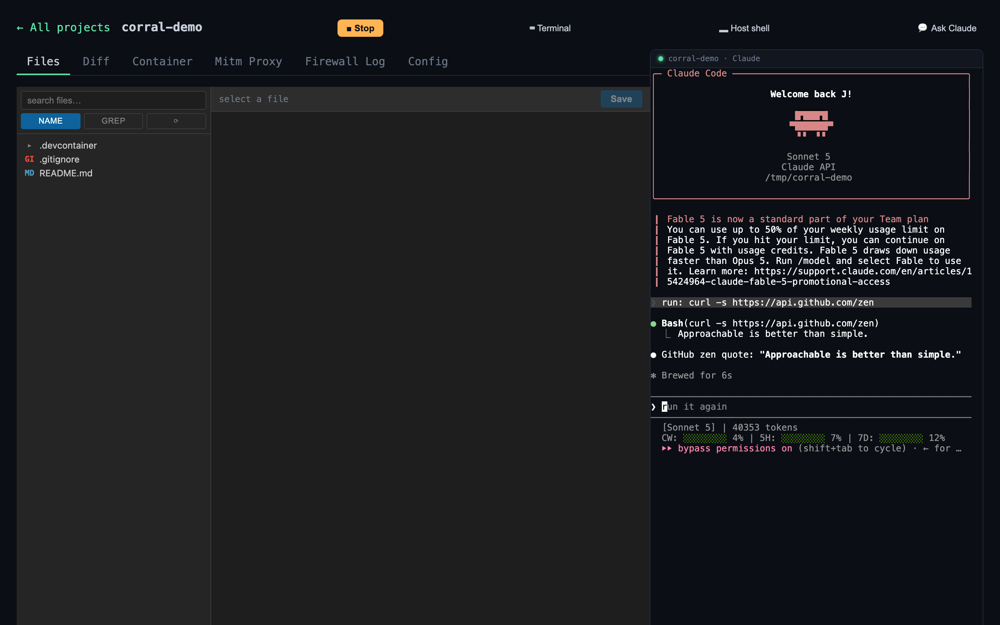

# Corral

Let Claude Code work on your project on autopilot — without worrying about what it
might touch. Corral runs Claude with permission prompts turned off, but inside
a safe bubble: it can only reach the sites you allow, it never sees your real
credentials, and everything happens in a throwaway container that leaves your
machine untouched. You watch it work in a live dashboard in your browser.



## Try it

```bash
# 1. install (Docker required; the installer adds its other host deps for you)
curl -fsSL https://raw.githubusercontent.com/scoutapp/corral/main/scripts/install.sh | bash

# 2. two commands get you going
corral populate-proxy-credentials   # set your credentials (once)
corral start                        # start Claude + open the dashboard
```

`start` prints a private link to the browser dashboard. From there, hit **New
project** to spin up a sandbox on a repo (or a blank/existing directory) and start
working — you watch Claude live, see what it's reaching out to, and drop into a
terminal, with one page covering **all** your projects at once.

Prefer the terminal? You can also drive a single project from the CLI: `cd` into
it, run `corral init` once to set up `./.corral/`, then `corral start` runs Claude
right there in that directory.

**→ New here? Read the [usage guide](docs/usage.md)** — a screenshot tour of the
dashboard and everything you can drive from your browser. It's the best place to
start.

## What keeps it safe

- **Nothing leaks.** Claude runs with a dummy token; your real credentials are
  swapped in behind the scenes and never enter its environment.
- **Nothing unexpected gets out.** Outbound network is limited to the sites you
  allow — including anything Claude spins up in Docker. (`start` is permissive at
  first so a new project just works, quietly recording what it uses; you lock it
  down to that list when ready — see the [usage guide](docs/usage.md#prefer-the-terminal).)
- **Nothing sticks around.** It all runs in a disposable container; close it and
  your machine is as it was.
- **You're always watching.** The live dashboard shows exactly what's happening.

For the full trust model — including the deliberate trade-offs and residual risks
(the privileged DinD container, loopback reachability, dangerous mode) — see
[`docs/security.md`](docs/security.md).

## Commands

The ones you'll use most:

| Command | What it does |
|---|---|
| `populate-proxy-credentials` | set your credentials (once) |
| `start` | start Claude + open the dashboard |
| `dashboard` | open the dashboard on its own |
| `init` | set up `./.corral/` in a directory (optional — only for the per-project CLI flow) |
| `update` | update Corral itself |
| `uninstall` | remove Corral from your machine |
| `help` | full command list and options |

For the complete list, see the [usage guide](docs/usage.md#command-reference) or
run `corral help`.

## Good to know

- You need [Docker](https://www.docker.com/) and Claude Code signed in (`claude`
  once). The installer pulls in its other host deps for you — `mitmproxy` (the
  credential proxy) and `tmux` (hosts the session) — via Homebrew or apt.
- Everything for a project lives in `./.corral/` (safe to delete to start over;
  `init` git-ignores it for you).
- Shared settings and credentials live in `~/.corral/`.
- Pin a version or change install locations with `CORRAL_VERSION`,
  `CORRAL_PREFIX`, `CORRAL_HOME` before the install command.

## For developers

Curious how it works under the hood, or want to hack on Corral itself? Start with
[`docs/developers.md`](docs/developers.md) — building from source, running the
tests, the release process, and how to actually iterate on Corral (spoiler: use a
local Claude, not Corral-on-Corral). The design is in
[`docs/architecture.md`](docs/architecture.md).

```bash
git clone https://github.com/scoutapp/corral.git && cd corral
./install.sh                     # build + install from source
go build -o corral ./cmd/corral && ./corral list   # or run from the checkout
go test ./... && (cd tests/e2e && npm test)                    # tests (e2e also runs in CI)
```

## License

[MIT](LICENSE) © Scout Monitoring
