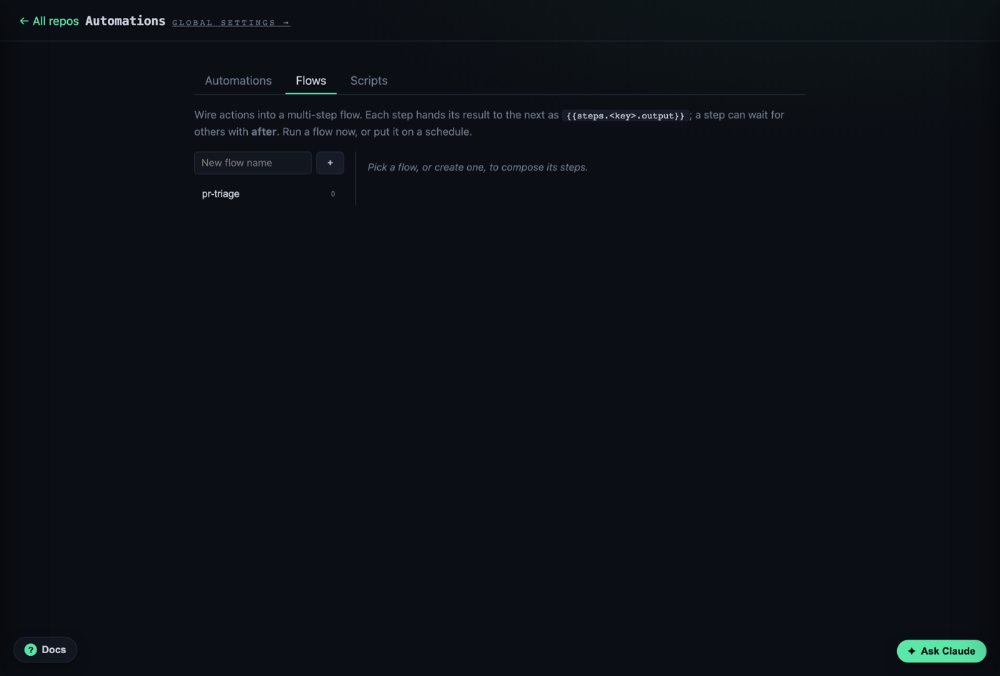

# Flows

A flow chains steps into one job you can run on demand or on a schedule. Each step
is an **action** (a prompt, a script, or an MCP call); each step's output is handed
to the next.

Find it at **Automations → Flows**.



## How steps connect

Every step has a **key**. A later step reads an earlier one's output with:

```
{{steps.<key>.output}}
```

Steps run top to bottom. A step can also wait for specific others with **after**
(depends-on) — independent steps still run in order, but this lets you express a
real dependency.

## Example: summarize a PR, then post it

Two prompt actions wired into a flow:

```
step "summary"  → Summarize PR #{{number}} in {{repo}}: risks, tests, recommendation.
step "comment"  → Post this as a PR comment:
                  {{steps.summary.output}}
```

1. **Automations → Flows**, type a name, click **+**.
2. Add the first step: pick the `summary` action, give it the key `summary`.
3. Add the second: pick `comment`, key `comment`. It references `{{steps.summary.output}}`.
4. **▶ Run now**, or give it a schedule.

## Scheduling

A flow can run on a fixed cadence (pseudo-cron). Set an interval and corral fires
it in the background; runs show up in the [Run Log](logs.md) tagged `schedule`.

## From the CLI

```bash
corral flow list
corral flow run pr-triage
```

## Gotchas

- **Keys are how data flows.** A typo in `{{steps.summary.output}}` just renders
  empty — check the key matches the step exactly.
- **A step that fails stops the flow.** Look at the run in the Run Log to see which
  step broke and its output.
- Scripts run **sandboxed**; every run-context value is exported as
  `CORRAL_<UPPER_SNAKE>` (e.g. `CORRAL_PR_NUMBER`).
