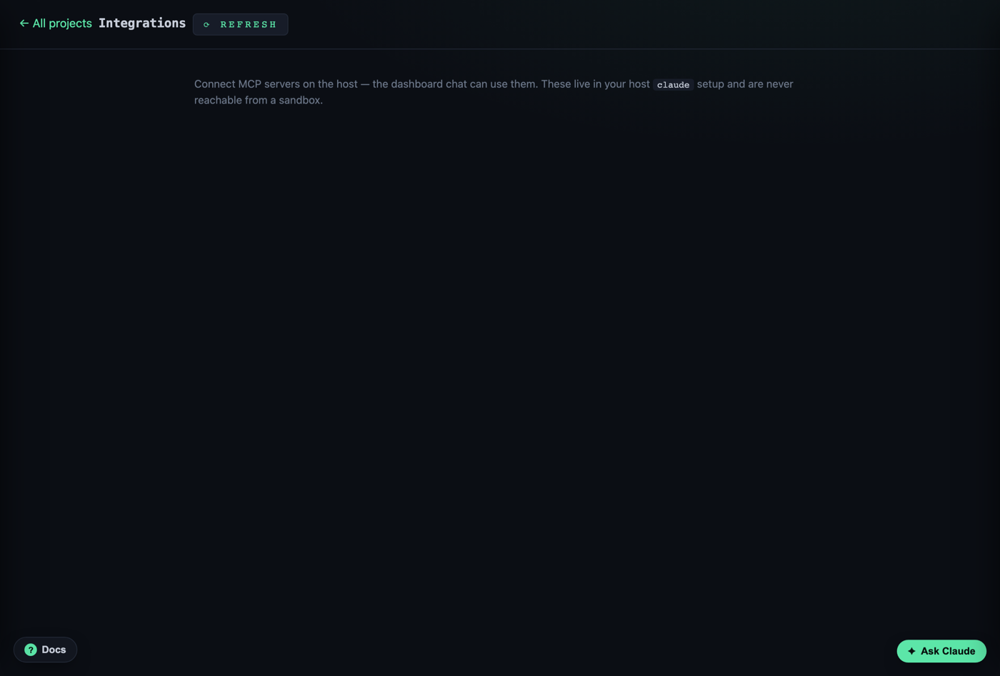

# Integrations (MCP)

Connect **MCP servers** on the host so the dashboard chat can use them. Find it at
**Integrations**.

## Connect one

Add the server and complete any auth it needs; it shows as **connected**. The
dashboard's Claude chat can now call its tools. Remove it to stop using it.

## Host-only, by design

These live in your host `claude mcp` registry — corral just drives it. The
**sandbox never reaches them**: MCP connections are a host capability, keeping the
one-directional trust intact. So an MCP server you connect here is available to the
dashboard chat, not to sandboxed Claude.

## Gotchas

- Auth happens in a host login flow — if a server needs it, finish that before it
  goes green.
- Nothing here yet? That's the empty state — add your first server.
