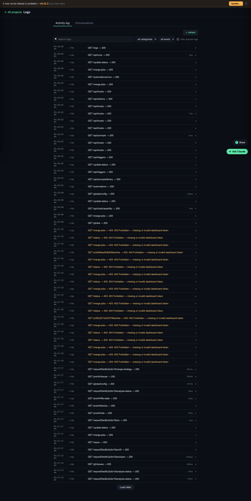

# Logs & run history

A searchable, host-wide record of what happened — across every project and the
dashboard itself. Find it at **Logs**.

## Use it

Filter by project or category, or search the text. It's the place to answer "what
happened around the time X broke?" Related events are linked together into spans,
so you can follow one action through its steps.

## Run history (flows & hooks)

**Automations → Run history** (or the **Run Log**) shows every [flow](flows.md) and
hook run. Click a run to see its steps, timing, and output — use it to confirm a
scheduled flow fired, or to find the step that failed.

## Gotchas

- Runs are tagged by how they started: `manual`, `api`, `hook`, or `schedule`.
- A failed flow stops at the broken step — its output is right there in the run.
