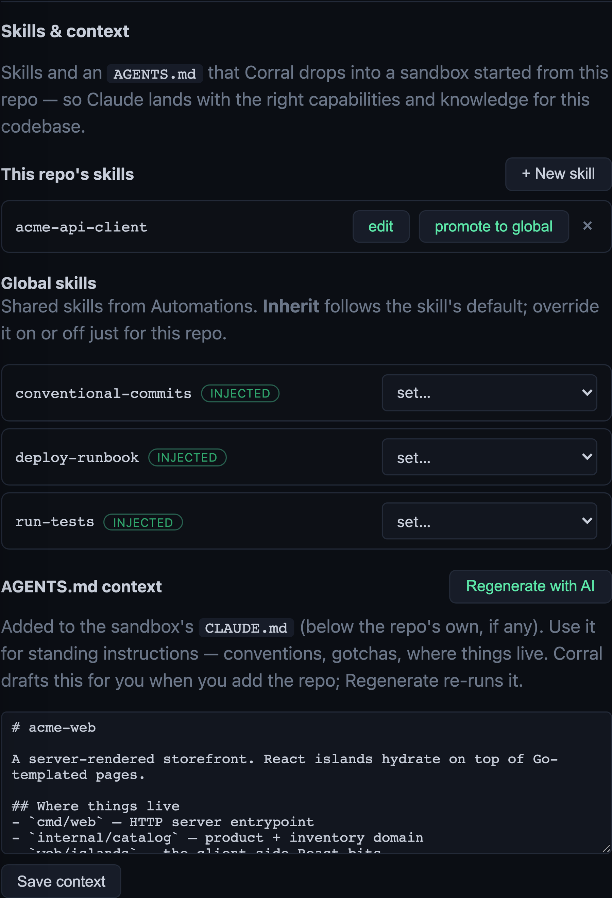
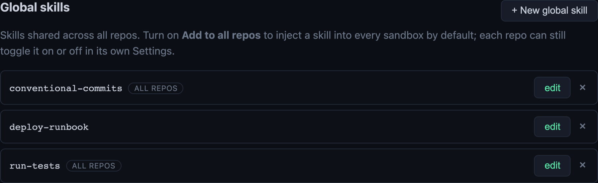

# Skills & context

Give a repo the right **skills** and an **AGENTS.md context**, and every sandbox
cloned from it lands already knowing your conventions and tools — no re-explaining
each time. Find it at a repo's **Settings → Skills & context**.



## Skills

A skill is a `SKILL.md` — a reusable capability (a workflow, a checklist, a set of
commands) with YAML frontmatter (`name`, `description`) then the instructions.
Corral drops each one into a checkout of this repo at
`.corral/skills/<name>/SKILL.md`, where Claude picks it up.

There are two kinds, both shown on this panel:

- **This repo's skills** — skills that belong to this repo only. Add, edit, or
  delete them here.
- **Global skills** — a shared catalog (see below) that any repo can inherit.

### Promote a repo skill to global

Wrote a skill that's useful everywhere? Hit **promote to global** on it. It moves
to the shared catalog so every other repo can use it too (it lands with
*add-to-all-repos* off, so nothing changes elsewhere until you opt in).

## Global skills

Global skills live in one shared catalog under **Automations → Automations →
Global skills**. Manage them there once, reuse them across every repo.



Turn on **Add to all repos** and a global skill is injected into *every* repo's
sandbox by default — the `ALL REPOS` badge marks the ones set that way. Leave it
off and the skill is opt-in per repo.

### Overriding a global skill for one repo (tri-state)

Back on a repo's **Skills & context**, each global skill has a per-repo control:

- **Inherit** — follow the global's *Add to all repos* default (the default).
- **On for this repo** — force it in here even if it's off by default.
- **Off for this repo** — keep it out here even if it's on-by-default everywhere.

The badge next to each name tells you the resolved outcome: `injected`,
`not injected`, or `overridden by repo skill` (a repo skill with the same name
wins).

## AGENTS.md context

Free-form guidance that becomes the repo's `CLAUDE.md` at the workspace root — the
file Claude reads on boot. Use it for standing instructions: conventions, gotchas,
where things live.

**Corral drafts this for you.** When you add a repo, a host worker explores the
codebase and writes a first-pass `AGENTS.md` automatically. Edit it inline and
**Save context**, or hit **Regenerate with AI** to re-run the draft (watch the
**Work** tab — it appears here when done). The generator itself is the editable
`repo.agents_md` prompt under **Automations → Prompts**.

If the repo already commits its own `CLAUDE.md`, corral's context is appended below
a marker rather than clobbering it.

### Staleness

An `AGENTS.md` drifts as the codebase moves on. Once a repo's context is older than
the staleness window (default **90 days ≈ 3 months**), corral shows a banner nudging
you to refresh it — with a one-click **Regenerate** that kicks the same AI draft as
the button above.

The banner follows the context everywhere it's used: the repo's **Settings**, any
**sandbox** started from the repo, and its **PR reviews** — so a stale context gets
noticed wherever you're working, not just on the repo page. Dismiss it and it stays
gone until the context changes (or goes stale) again.

Tune the window under **Global settings → AGENTS.md context → Flag stale after
(days)**: blank uses the default, and a negative value turns the check off.

## From the CLI

```
corral repo get-agent-context <repo-id>            # print the current context
corral repo set-agent-context <repo-id> --stdin    # read a new context from stdin
corral repo set-agent-context <repo-id> ""         # clear it
```

## Why bother

Set it once on the repo instead of re-explaining context every time you spin up a
sandbox. Global skills go a step further — write a capability once and share it
across every repo, overriding per-repo only where you need to.

## Gotchas

- Skill names must be filesystem-safe (letters, digits, `-`, `_`).
- A repo skill **shadows** a global skill of the same name — the repo one wins.
- Global skills are host-wide. Per-repo overrides layer on top; they never change
  the global default.
