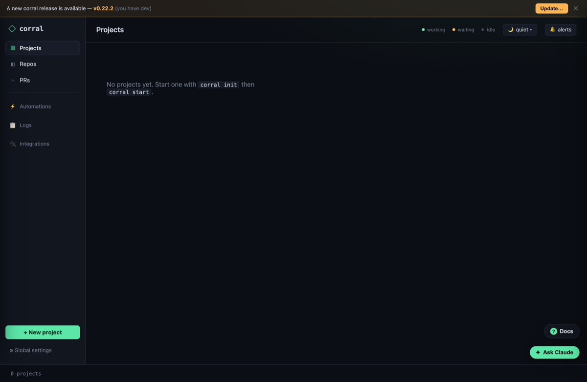
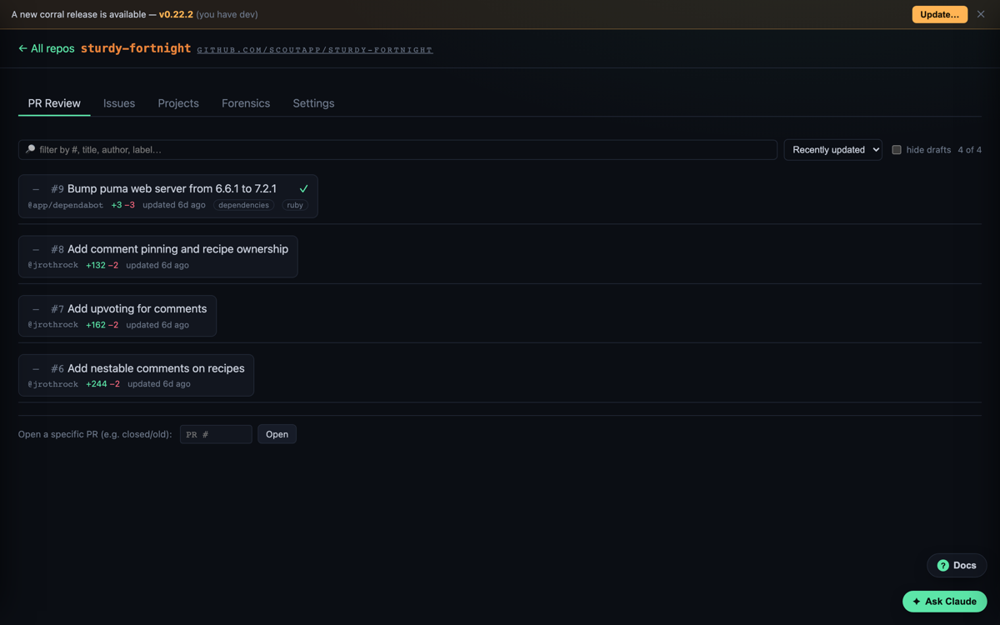
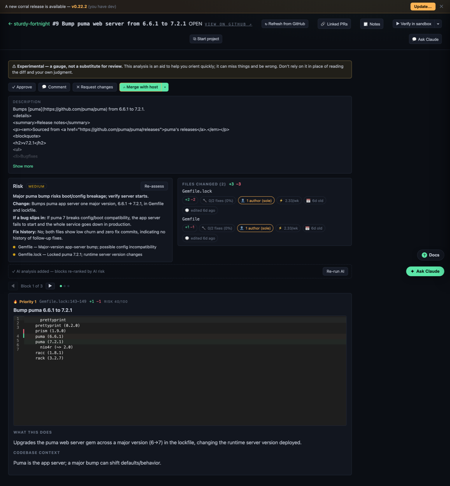
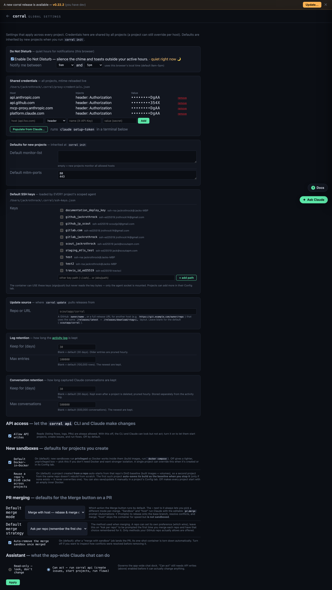
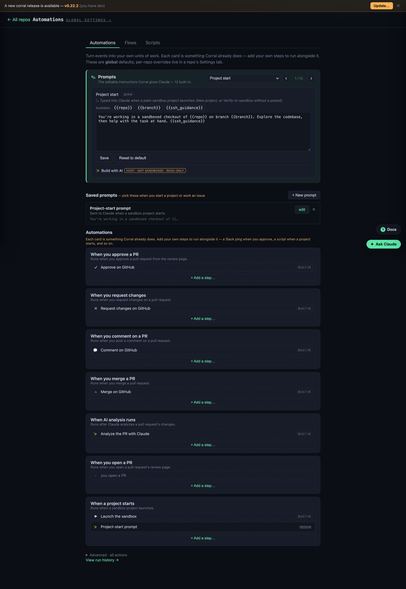
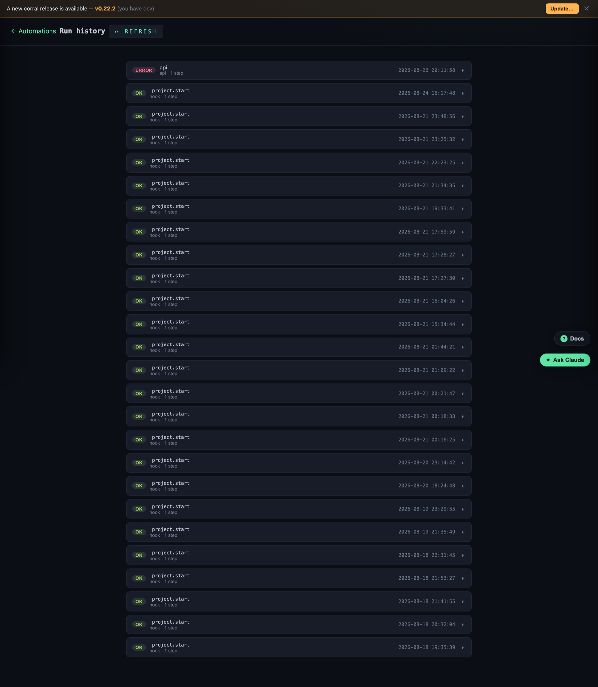
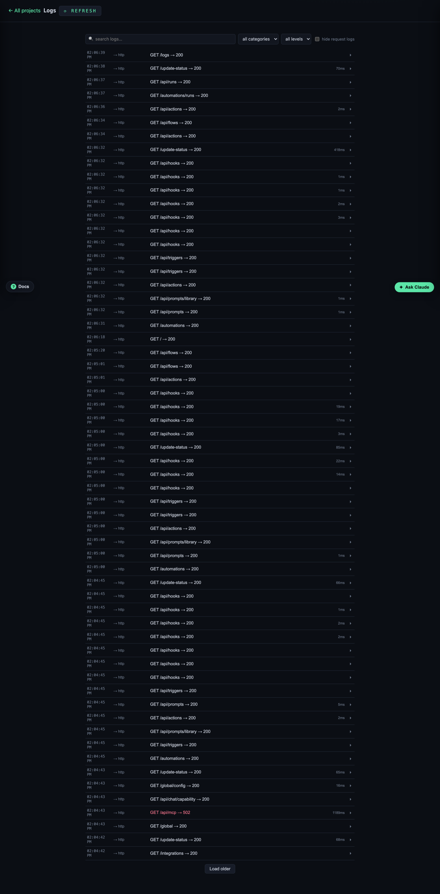
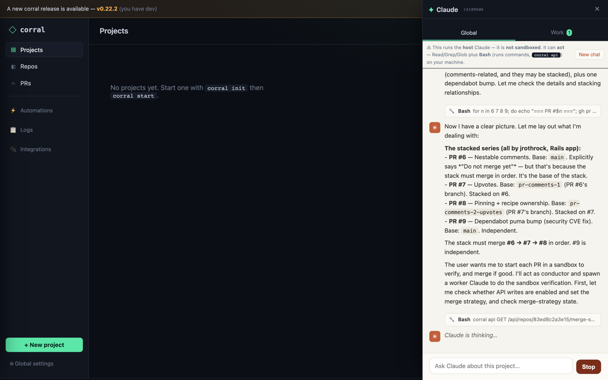
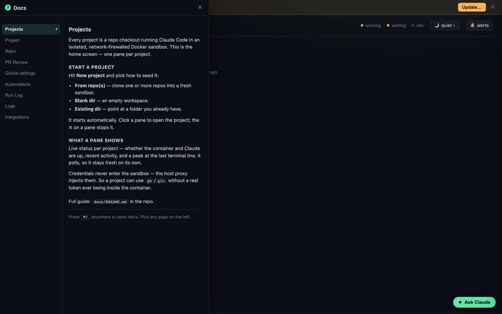

# Screenshots

A visual tour of the corral dashboard. (Captured against a throwaway demo repo.)
The same screenshots appear in the in-app docs drawer — press **⌘/** anywhere,
then pick a page from the sidebar.

## Projects

The home screen — one pane per sandboxed project. Each project is a repo checkout
running Claude Code in an isolated, network-firewalled Docker sandbox.

## Repo

A repo corral tracks — PR review, issues, projects spun off it, forensics, and
per-repo skills/context + automations.

## PR Review + AI analysis

Corral's read on one PR: the risk verdict, per-block AI analysis, churn/forensics,
and a merge split-button (host / sandbox / plain).

## Global settings

Host-wide defaults — SSH keys, global automations, PR-merging defaults.

## Automations

Prompts, event hooks, flows, and saved scripts.

## Run Log

A history of automation runs.

## Logs

The app-wide searchable activity log, with distributed traces.

## Integrations

Connect MCP servers (host-only — the sandbox never reaches these).

## Ask Claude — the global chat as a conductor

Ask the app-wide chat to review PRs, start them in a sandbox to verify, and merge
the good ones. It acts as a *conductor* — delegating each PR to a fresh worker
Claude shown in the **Work** tab.

## Docs drawer

The in-app docs (⌘/) — a sidebar to browse every page's docs, screenshots
included, no matter which page you're on.

