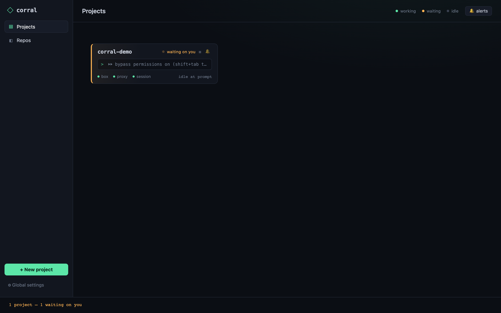
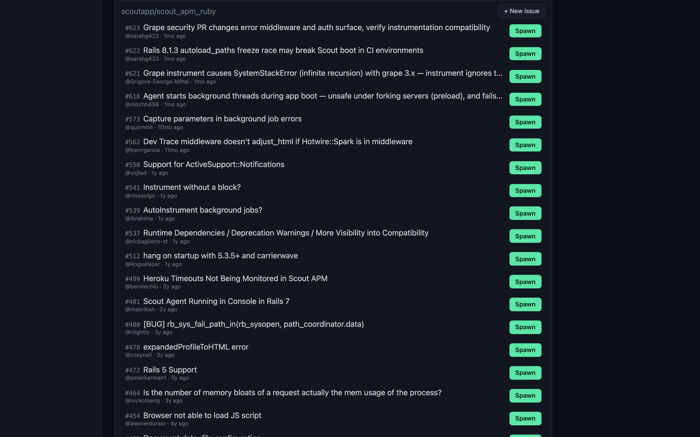
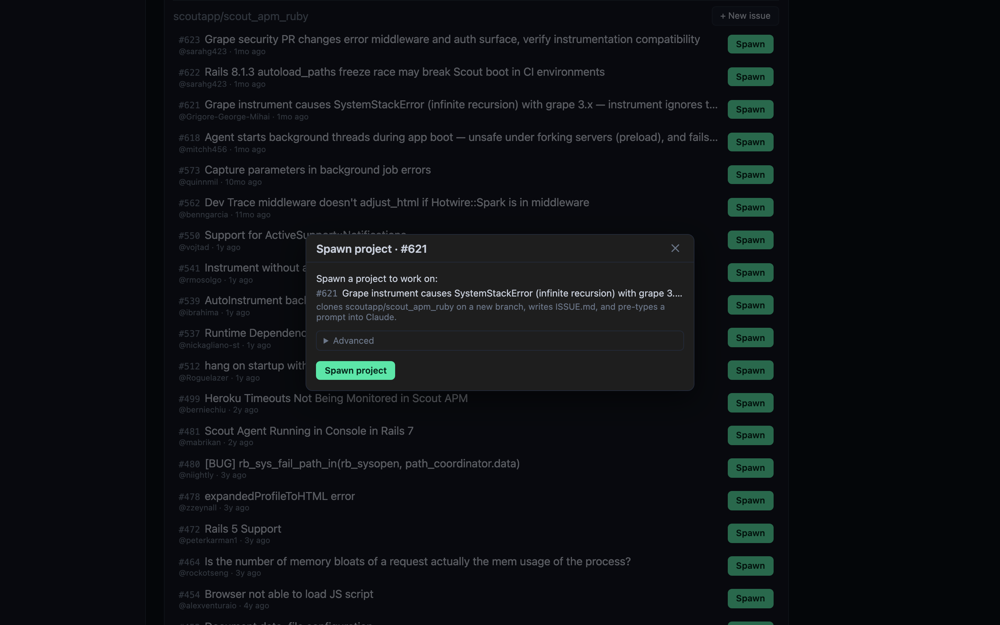
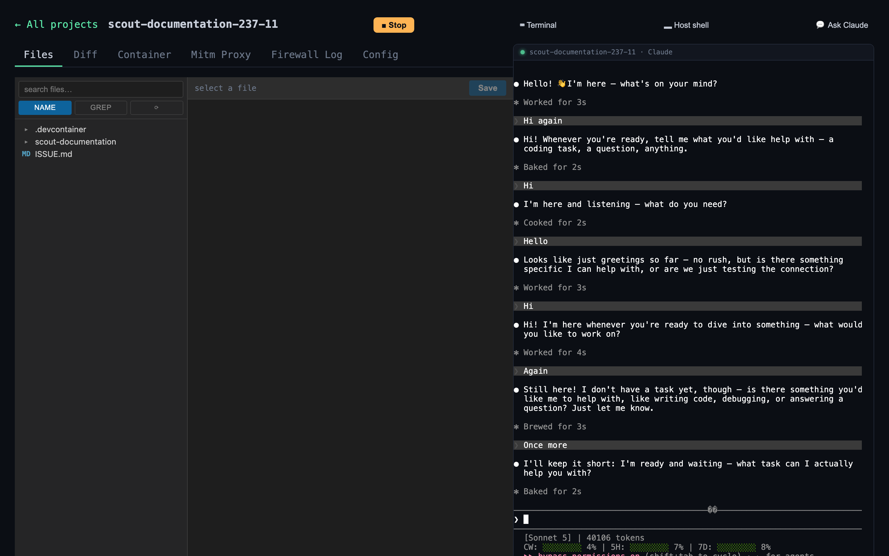
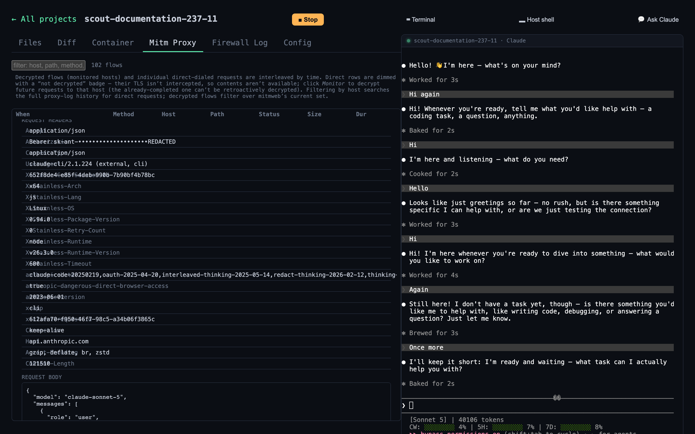
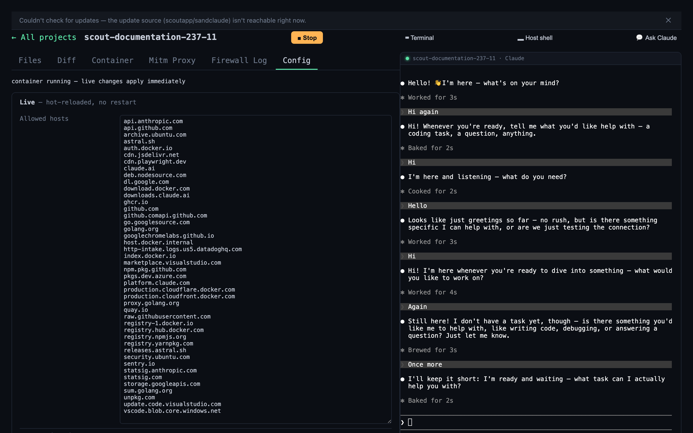
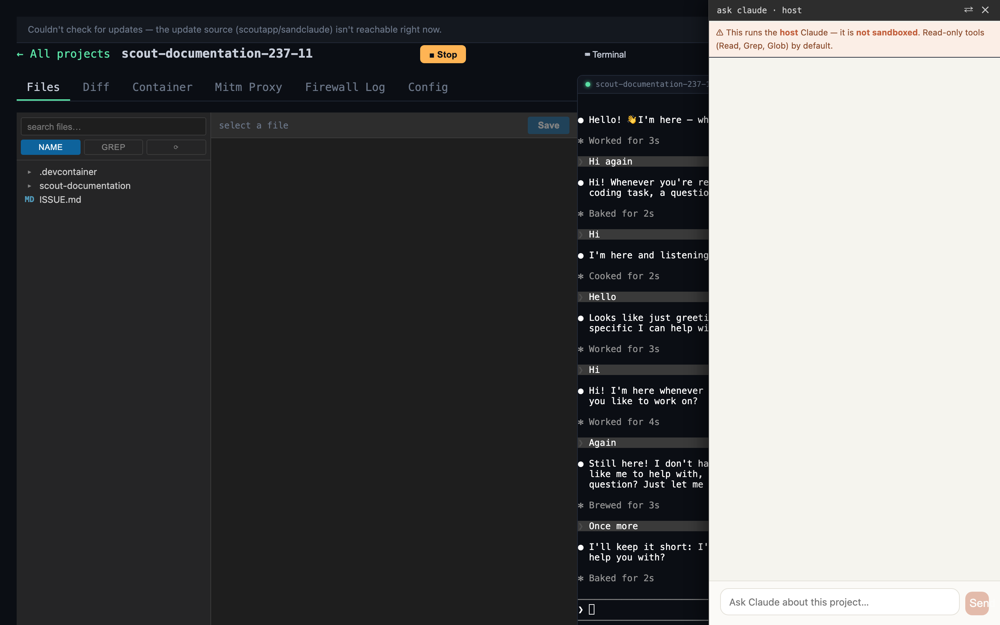
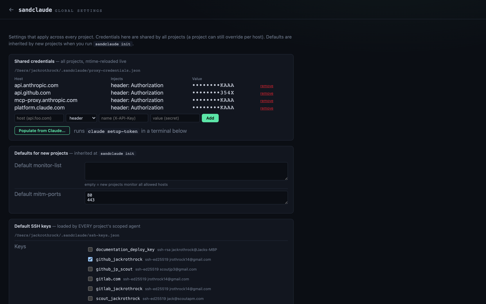
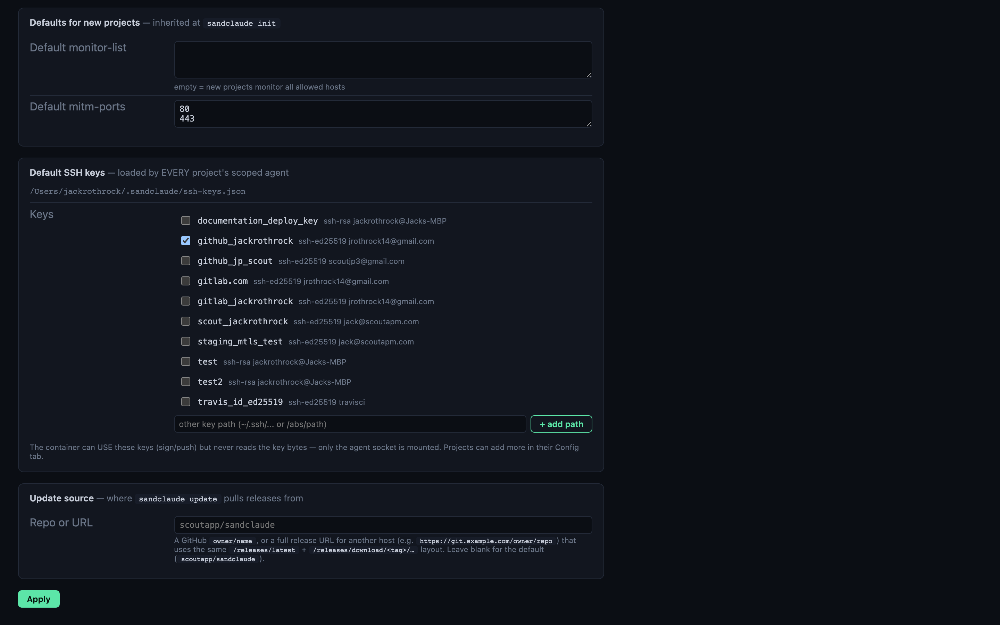

# Using Sandclaude

Sandclaude lets Claude Code work on your projects on autopilot — inside a safe
bubble — and you drive the whole thing from a **browser dashboard**. This guide is
dashboard-first; the CLI equivalents are noted alongside.

New here? [Install](../README.md#install) first, then come back.

---

## The dashboard

Everything starts with one command:

```bash
sandclaude dashboard        # opens the dashboard, prints a private link
```

It runs on your machine only (loopback) and the link carries a token — **treat the
link like a password**. One dashboard covers *all* your projects at once.



Each card is a project. The colored dots tell you at a glance where to look:

- 🟢 **working** — Claude is busy; nothing needed from you
- 🟡 **waiting** — Claude is stuck on a prompt and wants your attention
- ⚪ **idle** — not running

Use **▶** to start a project, **■** to stop it, **✕** to remove it. The
**alerts** toggle (top right) filters to just the projects waiting on you.

**Left rail:** *Projects* (this view), *Repos* (repos you've cloned in), and
**Global settings** at the bottom.

### Creating a project

Click **+ New project**. You can start from scratch in a folder you pick, or clone
a Git repo (private repos use your existing host `git`/`gh` login — no tokens are
stored). New projects start automatically.

> CLI equivalent: `cd ~/my-project && sandclaude init`.

### Spinning a project off a GitHub issue

Under **Repos**, each cloned repo has an **Issues** button that lists its open
GitHub issues:



Hit **Spawn** on any issue and Sandclaude offers to create a project for it —
cloning the repo on a fresh branch, writing an `ISSUE.md`, and pre-typing a prompt
into Claude so it can get straight to work. Nothing starts until you confirm:



---

## Working in a project

Click a card to open it. This is where you watch and drive Claude.



**Top bar:**

- **▶ Start / ■ Stop** — power the project's container on/off
- **⌨ Terminal** — show/hide the live Claude terminal (the dock on the right)
- **▂ Host shell** — a real shell on *your machine* in the project folder (`⌘J`)
- **💬 Ask Claude** — a quick chat with Claude about the project (`⌘K`)

The **Claude terminal** on the right is the live session — watch Claude work, or
type to it directly.

### The tabs

| Tab | What it's for |
|-----|----------------|
| **Files** | Browse and edit the project's files. Search by **name** or **grep** contents. |
| **Diff** | See what Claude changed, per file, against any branch. |
| **Container** | A shell *inside* the sandbox (not your host). |
| **Mitm Proxy** | Every request Claude made — see below. |
| **Firewall Log** | What the egress firewall allowed or blocked. |
| **Config** | This project's live settings and allowed-sites list. |

### Seeing what Claude reached out to

The **Mitm Proxy** tab is the heart of "know what it's doing." Every outbound
request is listed — method, host, path, status. Click a monitored request to open
its gutter and read the full exchange — headers and the request/response body.
Below, an expanded call to Anthropic showing the exact payload that was sent (your
real credential is injected by the proxy and never exposed to Claude):



Anything not being monitored is still logged, but its contents stay private. Want
to start capturing a host you aren't yet? Hit **Monitor** on its row to decrypt it
from then on.

### Tuning a project

The **Config** tab shows the live allowed-sites list and this project's settings.
Changes apply to the running container immediately — no restart.



> CLI: `sandclaude config` edits a project's config from the terminal.

### Ask Claude

Need a quick answer *about* the project without touching the main session? Open
**Ask Claude** (`⌘K`). Heads up: this runs Claude on your **host** and is **not
sandboxed** — it's read-only (Read/Grep/Glob) by default, and the panel says so.



---

## Global settings

The gear at the bottom-left holds settings shared across **every** project.



- **Shared credentials** — the real API keys/tokens Sandclaude injects on your
  behalf. Claude never sees them; it runs with dummy values. Add them by hand, or
  **Populate from Claude…** to pull your Claude login automatically. Values are
  masked.
- **Defaults for new projects** — the monitor-list and ports new projects inherit
  at creation.
- **Default SSH keys** — keys loaded into every project. The container can *use*
  them (sign, push) but never reads the key bytes.

> CLI: `sandclaude populate-proxy-credentials` sets credentials from the terminal.

---

## Keeping Sandclaude up to date

Sandclaude checks for new releases and shows a banner across the top when one's
available — click **Update…** to run the update in a terminal (it may ask for your
password if needed). If it can't reach the update source, you'll see a dismissible
"couldn't check for updates" notice instead.

You can point updates at a different source (e.g. a fork or a self-hosted mirror)
under **Global settings → Update source** — a GitHub `owner/name` or a full
release URL.



> CLI equivalents:
> ```bash
> sandclaude update --check                 # is there a newer release?
> sandclaude update                         # update the CLI + image
> sandclaude update --set-repo owner/name   # change the update source
> ```

---

## Prefer the terminal?

The dashboard is the main way to drive Sandclaude, but everything has a CLI:

```bash
sandclaude init      # set up a project (once)
sandclaude start     # start it (permissive by default: unknown sites are allowed + logged)
sandclaude dev       # start in the background: capture / send / attach
sandclaude config    # edit this project's settings
sandclaude list      # list projects
sandclaude update    # update Sandclaude itself
```

By default `start` runs in **permissive** mode — the proxy and credential
injection are on, but unknown sites are allowed and logged rather than blocked, so
a new project works right away while Sandclaude learns what it actually needs. Once
you know, lock it down:

```bash
sandclaude start --enforce-allowlist   # strict: block anything not on the allowlist
```

Run `sandclaude` with no arguments for the full command list.

---

## Related

- [README](../README.md) — install and the 60-second quickstart
- [Architecture](architecture.md) — how the sandbox is built
- [Security](security.md) — the trust boundaries, in detail
